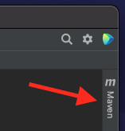
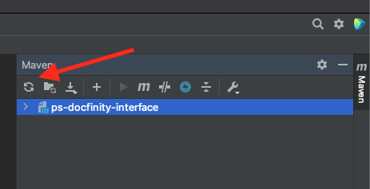
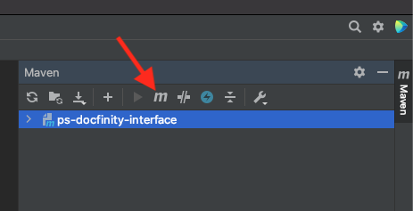

# PSDocfinityIterface


##Getting started
If you have a copy of this before it was moved to maven you will need to recheck this out and import it. Otherwise, you can just check out and import it.

Once the project is imported you should have the following tab intellij on the right side:



Click on it to open the maven toolbar.

Then you will need to load the maven dependencies by clicking the following button: 



When it is done importing the maven dependencies are done then you can run maven command by clicking on the following button:



To build the project run the following maven command:
```
mvn clean package
```

Once that is done you will have two jar files in your target directory:
```
ps-docfinity-interface-${version}.jar
ps-docfinity-interface-${version}-jar-with-dependencies.jar
```